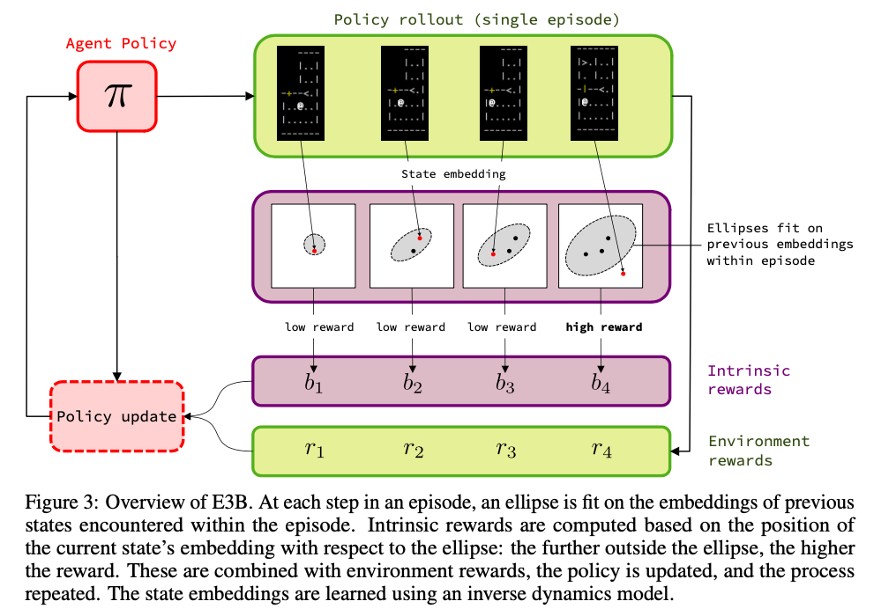

# Exploration via Elliptical Episodic Bonuses

This repo contains code for:

- the E3B algorithm described in the NeurIPS 2022 paper [Exploration via Elliptical Episodic Bonuses](https://arxiv.org/abs/2210.05805) by Mikael Henaff, Roberta Raileanu, Minqi Jiang and Tim Rocktäschel
- the experiments described in the ICML 2023 paper [A Study of Global and Episodic Bonuses for Exploration in Contextual MDPs](https://arxiv.org/abs/2306.03236) by Mikael Henaff, Minqi Jiang and Roberta Raileanu. 

E3B is an exploration algorithm designed for contextual MDPs, where the environment changes every episode. Examples of contextual MDPs include procedurally-generated environments such as MiniGrid, MiniHack, NetHack, ProcGen, and embodied AI settings such as Habitat where the agent finds itself in a new indoor space each episode.

The algorithm is simple to implement and operates using an elliptical bonus computed at the episode level, in a feature space induced by an inverse dynamics model.




## Running the code

Code to run E3B on MiniHack and Vizdoom using IMPALA as the base RL algorithm is contained in the `minihack/torchbeast` folder. This reproduces the experiments from the NeurIPS 2022 paper.  Code to run E3B on Habitat uses DD-PPO and is in the `habitat-lab` folder. Please see the README files in each folder for further instructions.

More recently, we have also implemented E3B using the APPO algorithm from the Sample Factory repo. This, combined with some architecture changes, increases the speed by about 10x on MiniHack, allowing for very fast experimentation. This is contained in the `minihack/sample_factory` folder. The numbers differ slightly from the results using IMPALA, but are overall similar. 


## Citation

If you use this code in your work, please cite the following:

```
@inproceedings{E3B,
  title     =     {Exploration via Elliptical Episodic Bonuses},
  author    =     {Mikael Henaff and Roberta Raileanu and Minqi Jiang and Tim Rocktäschel},
  booktitle =     {Advances in Neural Information Processing Systems (NeurIPS)},
  year      =     {2022}
}
```

and/or

```
@inproceedings{E3B,
  title     =     {A Study of Global and Episodic Bonuses for Exploration in Contextual MDPs},
  author    =     {Mikael Henaff and Minqi Jiang and Roberta Raileanu},
  booktitle =     {International Conference on Machine Learning (ICML)},
  year      =     {2023}
}
```


## Acknowledgements

This repo is built on the [Torchbeast](https://github.com/facebookresearch/torchbeast) code. We also use parts of the [RIDE](https://github.com/facebookresearch/impact-driven-exploration) and [NovelD](https://github.com/tianjunz/NovelD) codebases for baselines.

## License

The majority of this project is licensed under CC-BY-NC, however portions of the project are available under separate license terms: NovelD is licensed under the Apache 2.0 license and the Sample Factory implementation of E3B is licensed under the MIT License. 


